# 📐 Wiki: Arquitectura 'Diamond Tier' — StatCompare [v1.2.0]

Estructura técnica de la orquestación numérica mantenida por **DarckRovert**.

## 🏗️ Jerarquía del Sistema Stat Hub (Numerical Hierarchy)

**StatCompare** opera mediante una capa de análisis de equipo profundo:

1.  **Stat Scanner (`StatScanner.lua`)**: El motor que analiza cada slot de equipo, encantamiento y set de objetos para sumar los atributos totales (Crit, Hit, Damage, etc.).
2.  **UI Core (`StatCompare.lua`)**: Gestiona la inyección de los paneles de estadísticas en el PaperDoll de Blizzard y el panel de Inspeccionado.
3.  **Localization Sync (`Localization.lua`)**: Diccionario de mapeo de nombres de atributos para asegurar la compatibilidad entre clientes esES, enUS y zhCN.
4.  **BCS Sync Engine**: Módulo de sincronización con `BetterCharacterStats` para asegurar coherencia en la visualización de estadísticas avanzadas.

---

## 🧭 Diagrama de Flujo: Escaneo de Atributos v9.4

```mermaid
graph TD
    A[Inicio: Abrir Panel Personaje] --> B[Disparo de StatScanner:ScanGear]
    B --> C[Análisis de Slots 1-19]
    C --> D[Carga de Bonos de Set y Encantamientos]
    D --> E[Suma de Atributos Base + Bonos]
    E --> F[Inyección de Datos en UI Diamond Tier]
    F --> G{¿Modo Inspeccionar?}
    G -- Sí --> H[Sincronización con Datos del Objetivo]
    G -- No --> I[Persistencia en SavedVariables]
    H --> J[Comparativa Instantánea de Atributos]
    I --> J
```

## ⚡ Estrategias de Ingeniería Diamond Tier

- **Deep Link Analysis**: StatCompare v9.4 analiza los enlaces de objetos (`ItemLinks`) de forma recursiva para extraer estadísticas ocultas que no se muestran en el tooltip básico pero que afectan al rendimiento real.
- **Cache-Optimized Scan**: El motor de escaneo solo recalcula los atributos si detecta un cambio en el equipo (evento `PLAYER_EQUIPMENT_CHANGED`), optimizando el uso de la CPU.
- **Turtle WoW Attribute Alignment**: Inclusión de los nuevos atributos de las razas de Turtle WoW (ej: Habilidades raciales de Arcanista) en los diccionarios Diamond Tier.

---
© 2026 **DarckRovert** — El Séquito del Terror.
*Sincronización numérica para la conquista de Azeroth.*

